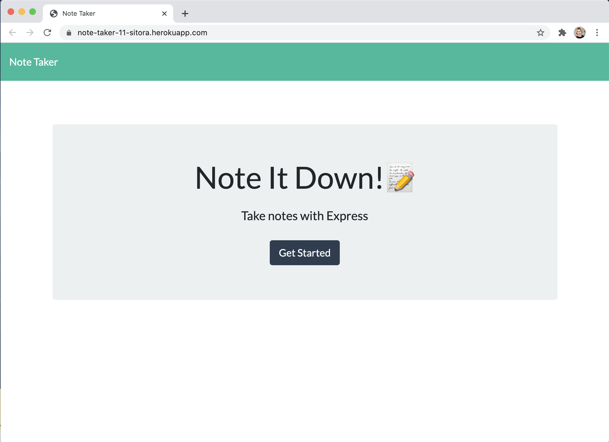
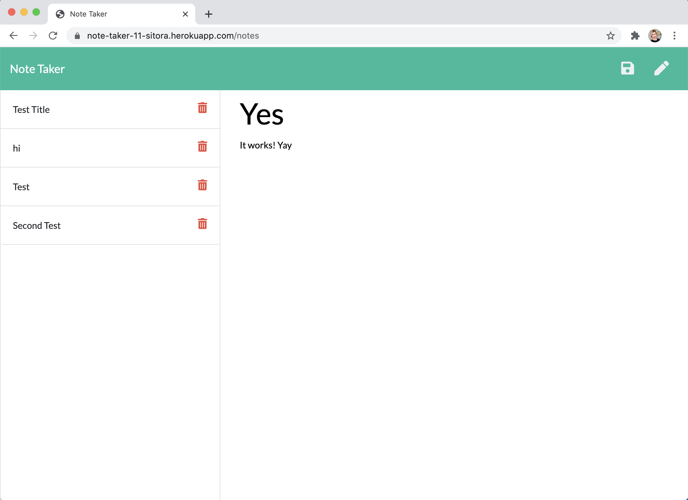

## About the app: Note Taker

For users that need to keep track of a lot of information, it's easy to forget or be unable to recall something important. Being able to take persistent notes allows users to have written information available when needed.

## Check out the app by clicking on the link below:
https://note-taker-11-sitora.herokuapp.com/

## Screenshots:

## Technology: 
This application uses an express backend. It saves and retrieves note data from a JSON file.

### Web/App Link: https://note-taker-11-sitora.herokuapp.com/ 
### Github Repo: https://github.com/sitoraalexander/11-note-taker

### Thank you :) 